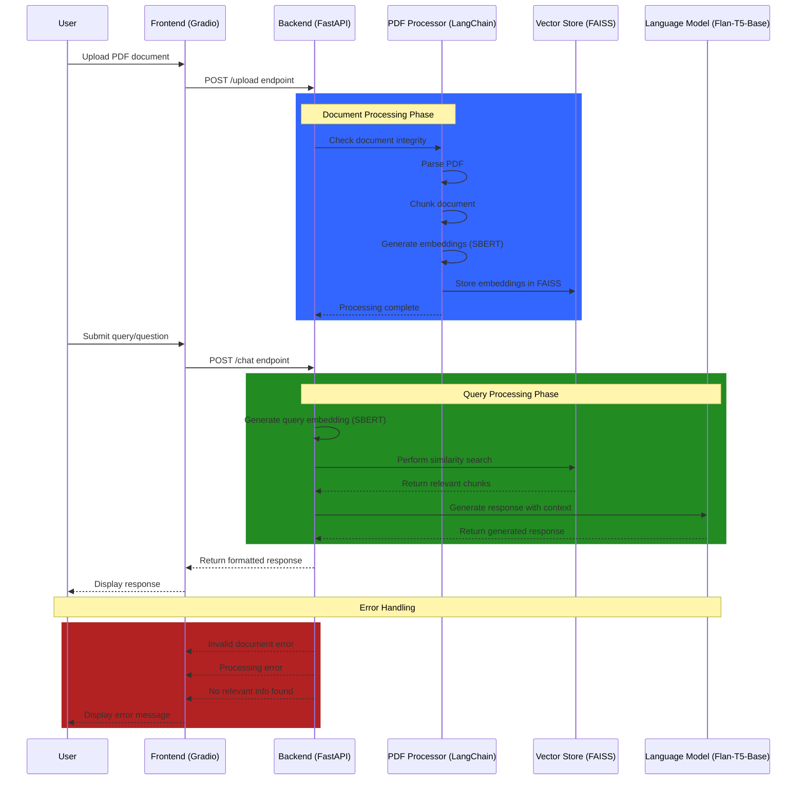
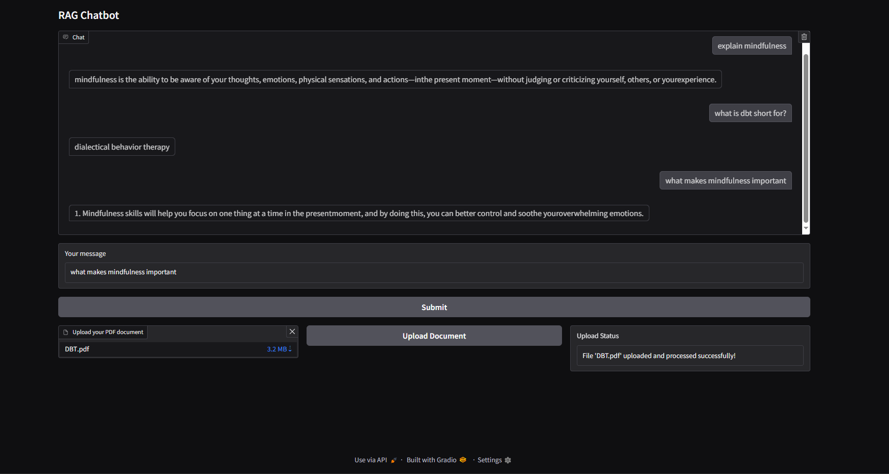

# RAG Chatbot

A Retrieval-Augmented Generation (RAG) chatbot built using FastAPI, Gradio, and LangChain, leveraging state-of-the-art models for natural language understanding and text generation. This chatbot allows users to upload PDF documents, process them into searchable chunks, and perform conversational interactions using the retrieved document context to generate accurate and contextualized responses.

The following sequence diagram illustrates the end-to-end workflow of the RAG chatbot.



# Installation

## Clone the repository

```Terminal
git clone https://github.com/dhmahdi/rag-chatbot.git
```
```Terminal
cd rag-chatbot
```

## Use a virtual environment (optional)

```Terminal
python -m venv venv
```
- MacOS / Linux

```MacOS / Linux
source venv/bin/activate
```
- Windows

```Windows
venv\Scripts\activate
```

## Install dependencies

```Terminal
pip install -r requirements.txt
```

## Run the backend server
```Terminal
python -m uvicorn backend:app --reload
```

## Launch the Gradio UI

```Terminal
python main.py
```

## Endpoints

/upload: Handles PDF uploads and processes documents into vectorized chunks.

/chat: Accepts user queries, retrieves relevant chunks, and generates responses.


# Code Overview

## Backend Code (FastAPI)

### File: backend.py

### Key Responsibilities:

Process PDF documents using PyPDFLoader.

Generate embeddings for document chunks using SBERT.

Perform similarity search and retrieve document chunks using FAISS.

Generate responses to user queries using Flan-T5.

## Frontend Code (Gradio)

### File: main.py

### Key Responsibilities:

Provide a user-friendly interface for uploading documents and chatting.

Connect to the FastAPI backend for processing and response generation.

# UI

<div align="center">
  
</div>

# Future Improvements

Add support for more document formats (e.g., Word, Excel).

Enhance conversational capabilities with follow-up question understanding.

Integrate more advanced document retrievers and generators.

# Acknowledgments

This project uses state-of-the-art tools and frameworks from the open-source community, including Hugging Face, LangChain, and Gradio. Special thanks to the contributors behind these libraries!